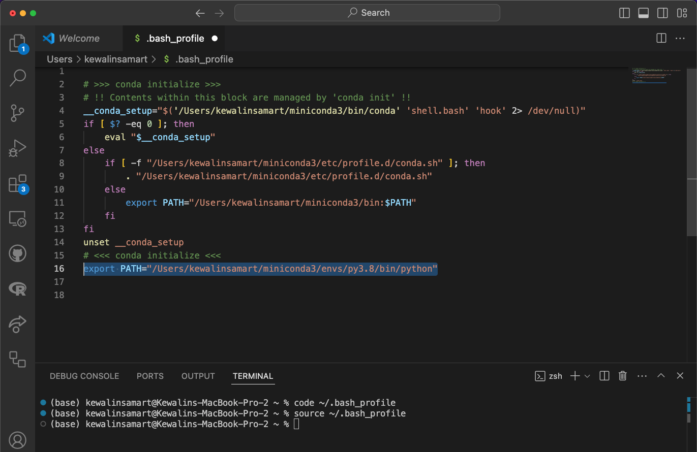

## Using Python in RStudio

### Mac & Linux users

You can now use RStudio as an effective Python IDE. To do so, follow these steps after installing miniconda:

1. Install the {reticulate} package: `install.packages("reticulate")`

2. Install the {png} package (a dependency of reticulate that is not well managed yet): `install.packages("png")`
3. In your home directory, create conda environment with a python version 3.8 (preferred) by typing `Conda create -n py3.8 python=3.8` in the terminal.  
    
4. Activate the conda environment by typing `conda activate py3.8`
5. Find your path to miniconda by typing `which python` in a terminal (Git Bash on Windows) outside of RStudio
    
6. Specify that {reticulate} should use the miniconda version of Python in your `.Rprofile` file:

    - type `usethis::edit_r_profile()` into the R console inside RStudio, and an `.Rprofile` file from your HOME directory should open in RStudio
    - add this to your `.Rprofile` file: `Sys.setenv(RETICULATE_PYTHON = "path_to_miniconda's_python")` replacing `"path_to_miniconda's_python"` with the path to your miniconda Python
    Note: On most Mac/Linux systems, this would look like: `/Users/yourusername/miniconda3/envs/py3.8/bin/python`
  
7. In terminal in VSCode, type `code ~/.bash_profile` and add the line `export PATH="/opt/miniconda3/bin:$PATH"`, replacing `/opt/miniconda3/bin` with the path to the folder containing your miniconda Python (be careful not to include `python` at the end of this path). 

!! If you’re encountering the error `zsh: command not found`: code when trying to use the code command for Visual Studio Code, follow these steps to resolve it:

  - Step 1: Verify VS Code Installation to make sure Visual Studio Code is installed on your system.
    - Download and install it from [VS Code's website](https://code.visualstudio.com/).
    - Open VS Code to confirm it is installed correctly.
  - Step 2: Install the code Command in PATH
    - Open Visual Studio Code.
    - Access the Command Palett`e:
      - On Mac: `Cmd + Shift + P`
      - On Windows/Linux: `Ctrl + Shift + P`
    - Type: `Shell Command: Install 'code' command in PATH` 
    - Select the option. You should see a success message.
  
6. **Restart R!**

7. Start using Python in RStudio by typing `reticulate::repl_python()` in the R console, or running a line of Python code from a Python script from the RStudio editor by Cntrl + enter. Or by running scripts from the terminal inside RStudio.

### Windows users

1. Install the {reticulate} package: `install.packages("reticulate")`

2. Install the {png} package (a dependency of reticulate that is not well managed yet): `install.packages("png")`

3. Follow step 3–5 for Mac & Linux users to create a `conda` environment with a python 3.8 (preferred)
4. Find your path to miniconda by typing `where python` in a terminal (Git Bash on Windows) outside of RStudio

5. Specify that {reticulate} should use the miniconda version of Python in your `.Rprofile` file:

  - type `usethis::edit_r_profile()` into the R console inside RStudio, and an `.Rprofile` file from your HOME directory should open in RStudio
  - add this to your `.Rprofile` file: `Sys.setenv(RETICULATE_PYTHON = "path_to_miniconda's_python")` replacing `"path_to_miniconda's_python"` with the path to your miniconda Python. In Windows, you need `\\` instead of a `\` to separate the directories, for example my path here would be: `C:\\Users\\tiffany.timbers\\miniconda3\\python.exe`.
  
6. Open Global Options in RStudio and in the Terminal sub-menu, select "Custom" as the "New terminals to open with" option, and add the path to GitBash (should be something like `C:/Program Files/Git/bin/bash.exe`) as the "Custom shell binary" option. Finally set `-l` (lower case L) as the option for "Custom shell command-line options".

7. **Restart R!** Open R and close the terminal tab. Open a new terminal.

8. Start using Python in RStudio by typing `reticulate::repl_python()` in the R console, or running a line of Python code from a Python script from the RStudio editor by Cntrl + enter. Or by running scripts from the terminal inside RStudio.
